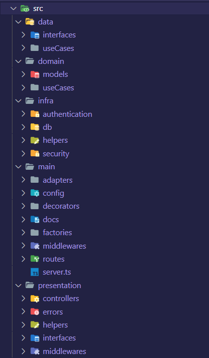

# NodeJS Budget Manager API
### API para gerenciamento e controle de gastos mensais.
A API foi criada seguindo os principios de TDD, SOLID o máximo possível, Clean Architeture e Clean Code o máximo possível, a idéia era manter todo o código desacoplado afim de facilitar manutenção e prover legibilidade e coesão do código. 

---
## 🤔 Problema

Sérgio é um desenvolvedor Frontend e está trabalhando em um projeto pessoal para ajudá-lo a controlar suas finanças e precisa da sua ajuda. Sérgio tem problema com seus gastos. Durante o mês ele gasta mais do que deveria e por isso resolveu criar uma aplicação web que ajude-o a ter um melhor controle financeiro.

---

## 🚀 Escopo 

Para ajudar Sérgio a desenvolver seu projeto, ele precisa que você elabore um backend que ele possa consumir para finalizar o seu sistema.

---

## 🔎 Casos de Uso
(Legenda: ✅ Criado, 📝 Documentado, ⬜ Pendente)
- ✅ 📝 Autenticação e acesso à plataforma.
- ✅ 📝 Criação de orçamento mensal.
- ✅ 📝 Registro de gastos.
- ✅ 📝 Visualização de gastos.
- ✅ 📝 Atualização de gasto.

Para conseguir seguir o seu orçamento de gastos Sérgio poderá compartilhar o seu progresso com outros usuários e para isso precisará dos seguintes recursos:

- ✅ 📝 Enviar convite de acompanhamento para usuários já cadastrados na plataforma.
- ✅ 📝 Cancelar um convite.
- ✅ 📝 Aprovar uma solicitação de convite.
- ✅ 📝 Rejeitar um solicitação de convite.
- ✅ 📝 Visualizar convites recebidos.
- ✅ 📝 Visualizar convites enviados.

**Obs.:** Um convidado deve **apenas poder <u>visualizar</u>** o progresso do orçamento mensal.

---
## ✅ Extras Task List

- ✅ Documentação em Swagger.
- ✅ Docker.

---
## ✔️ Implementações futuras
- ⬜ ⬜ Visualizar gastos compartilhados com o usuário.
- ⬜ ⬜ Intejar validador de identidade para não permitir alterações em documentos que o usário não possui acesso.
- ⬜ ⬜ Fazer autenticação nativa do Firebase.
- ⬜ ⬜ Otimizar testes de integração
  
---
## 👁️ Cobertura de Testes
**98.76%** Statements `481/487` | **95.08%** Branches `58/61` | **99.21%** Functions `126/127` | **99.11%** Lines `446/450` 

Test Suites *(passed/total)* **53**/53 | Tests *(passed/total)* **220**/220

---
## 🗂️ Estrutura de Pastas

---
## 🧱 Tecnologias utilizadas

- Node.js com Typescript.
- Firestore.
- Testes automatizados com Jest.
- Arquitetura REST.
- Swagger.
- Docker.
- Husky para pre-commit e pre-push scripts.
---
## 💻 Executando e Desenvolvendo
Para setup de desenvolvimento basta fazer seguir os passos a seguir:
1. Clone do repositório.
2. Executar `npm install`
3. Caso deseje usar o Husky execute `npx husky install`
4. Copiar a chave do Firestore para ./keys
5. Executar `npm run dev`

---

## 🚀 Build de Produção (docker)
Execute `npm run up`

---
## 🔍 Testes
- Testes de unidade com `npm run test:unit`
- Testes de integração com `npm run test:integration`
- Para executar o coverage execute `npm run test:coverage`

